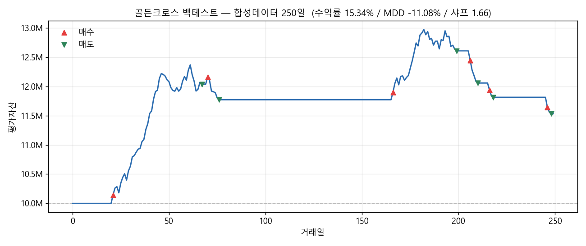

# 자동매매 봇 (한국 주식 / 가상매매)

다른 투자자들의 매매법을 **백테스트**(과거 검증)와 **실시간 모의투자**(라이브 검증)로
돌려보는 가상매매 프로그램. Python 표준 라이브러리만으로 단계 1이 동작한다.

## 핵심 설계
> **전략은 신호(Signal)만 내고, 체결은 브로커가 한다.**
> 데이터피드와 브로커만 교체하면 같은 전략이 백테스트 ↔ 모의투자에서 그대로 돈다.

```
[데이터피드] → [전략] → Signal → [브로커] → Fill → [계좌] → [리포트]
```

## 바로 실행
```bash
python run_backtest.py
```
→ 합성 데이터 250일에 골든크로스 전략을 돌리고 수익률/MDD/샤프를 출력,
  `backtest_trades.csv`에 매매내역 저장. (Python 3.10+ 권장)

## 실행 결과

키 없이 바로 도는 합성데이터 250일 백테스트다.

```
=== 백테스트 결과 (골든크로스 / 합성데이터 250일) ===
  초기자본: 10,000,000원
  최종자산: 11,534,473원
  총수익률: 15.34%
  MDD: -11.08%
  샤프지수: 1.66
  체결건수: 12
  매도건수: 6
```



수수료 0.015%, 세금 0.18%, 슬리피지 0.05%를 물린 뒤의 곡선이다.
가운데가 평평한 구간은 데드크로스로 팔고 현금으로 쉬고 있던 때다.

**이 숫자는 합성 데이터 결과다.** 전략이 좋다는 근거가 아니라 파이프라인이
끝까지 돈다는 확인용이다.

## 폴더 구조
```
core/          이벤트 타입 · 인터페이스 · 메인 엔진(공용 루프)
data/feeds/    데이터 공급 (historical: CSV·합성 / 추후 kis_realtime)
strategies/    매매법 모음
  rule_based/    ① 규칙 직접 코딩 (golden_cross, _template)
  copy/          ② 카피 트레이딩 (단계 5)
broker/        체결 엔진 (simulated: 수수료·세금·슬리피지 반영)
portfolio/     계좌·평단·평가자산 (추후 risk 한도)
reporting/     성과지표 · 매매내역 CSV
```

## 새 매매법 추가하는 법
`strategies/rule_based/_template.py`를 복사 → `on_bar`에 매매 규칙 작성 →
`run_backtest.py`에서 import만 교체. **사람 한 명 = 전략 파일 하나.**

## 진행 로드맵
- [x] 1. core + 모의체결 + 백테스트 동작 ← **지금 여기**
- [ ] 2. 전략 다양화 + 리포트 고도화
- [ ] 3. KIS 과거데이터 로더 (실데이터 백테스트)
- [ ] 4. KIS 실시간 시세 + 실시간 모의투자 루프 (`run_paper.py`)
- [ ] 5. 카피 시그널 수신 (텔레그램/웹훅) → 팔로워
- [ ] 6. 리스크 한도 + KIS 공식 모의투자 계좌 연동

## 주의
- 수수료·세율(`broker/simulated.py`)은 기본값이다. 실제 증권사/연도 기준으로 교체할 것.
- API 키는 `.env`에만 두고 절대 커밋하지 말 것 (`.env.example` 참고).
